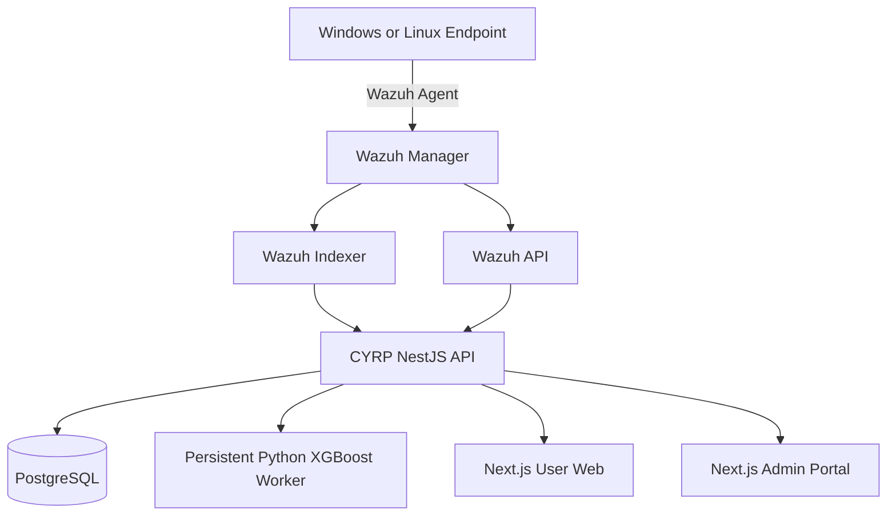

# AegisPulse CYRP

AI-assisted endpoint security and vulnerability prioritization platform powered by Wazuh, NestJS, PostgreSQL, Next.js, and XGBoost.

## Core capabilities

- Administrator-provisioned user accounts.
- Windows and Linux endpoint enrollment.
- Device-to-Wazuh Agent binding.
- Wazuh security-data synchronization.
- CVSS and threat-intelligence enrichment.
- XGBoost-based probability, percentile, and risk ranking.
- Asynchronous machine checks using REST API polling.
- Cached repeated checks.
- Separate User Web and Admin Portal.
- PostgreSQL-backed snapshots and history.

## Architecture



## Main flow

```mermaid
flowchart LR
    A[Admin creates account] --> B[User signs in]
    B --> C[User creates enrollment code]
    C --> D[Endpoint configures Wazuh Agent]
    D --> E[CYRP creates Device-Agent binding]
    E --> F[Wazuh collects security data]
    F --> G[CYRP synchronizes data]
    G --> H[XGBoost ranks vulnerability risk]
    H --> I[Web portals display results]
```



## Technology stack

| Layer | Technology |
|---|---|
| Backend | NestJS and TypeScript |
| User interface | Next.js and React |
| Admin interface | Next.js and React |
| Database | PostgreSQL and Prisma |
| Endpoint security | Wazuh |
| Machine learning | Python and XGBoost |
| Infrastructure | Docker Compose |
| Package management | pnpm workspace |

## AI model

Stable model version:

```text
CYRP_XGBOOST_CVSS_PERCENTILE_V3
```

| Metric | Result |
|---|---:|
| ROC-AUC | 0.8933 |
| PR-AUC | 0.3401 |
| Brier score | 0.1330 |
| Log loss | 0.4091 |
| Recall at threshold 0.5 | 0.8336 |
| F1 at threshold 0.5 | 0.3920 |

Percentile is a relative rank within the model reference distribution. It is not an attack probability.

## Portfolio highlights

- Cybersecurity platform architecture.
- Wazuh SIEM and XDR integration.
- REST API design and polling.
- Role-based access control.
- Machine-learning integration.
- Cross-platform endpoint enrollment.
- Performance optimization and caching.
- Failure recovery and startup guardrails.

## Project status

Completed academic prototype with validated end-to-end flows. A production deployment would require formal security review, external secret management, observability, load testing, and infrastructure hardening.

## Training data

The full training dataset is intentionally not included in this repository because of file size, redistribution, and data-governance considerations. The repository contains the model integration and runtime architecture, while dataset preparation should be documented and reproduced separately using an authorized data source.
