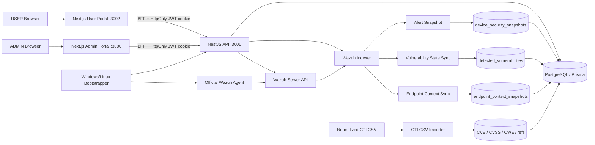
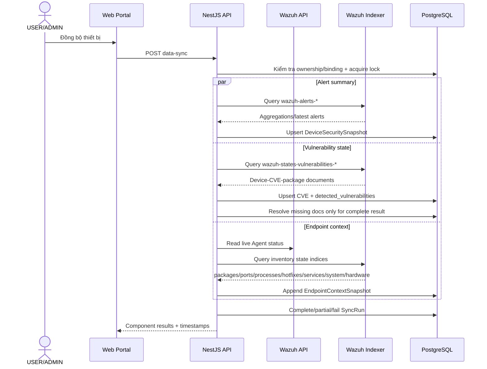
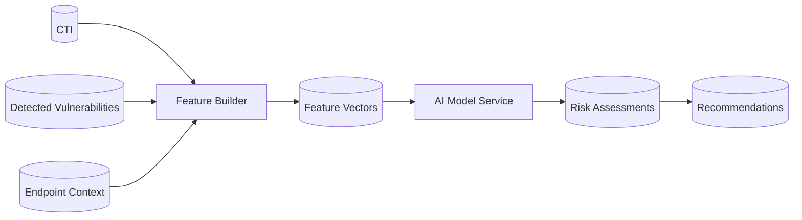

# Kiến trúc CYRP — Phase 2

## 1. Kiến trúc đã triển khai



## 2. Phân tách trách nhiệm

### Wazuh

- Agent thu thập inventory/telemetry endpoint.
- Manager quản lý Agent và phát hiện lỗ hổng.
- Indexer giữ alert và state index.

### CYRP Backend

- Xác thực, RBAC và ownership.
- Quản lý Device–Agent binding.
- Đọc Wazuh bằng service account phía server.
- Chuẩn hóa state documents.
- Đồng bộ idempotent vào PostgreSQL.
- Lưu snapshot lịch sử và metadata sync.
- Phục vụ API cho hai portal.

### PostgreSQL

- Identity/device/binding.
- Current operational snapshot.
- CTI normalized tables.
- Detected vulnerability history/state.
- Endpoint context append-only.
- Sync observability.

### Portal

- Không truy cập trực tiếp Wazuh/Indexer.
- Không giữ JWT trong JavaScript; BFF sử dụng HttpOnly cookie.
- Phân tách USER và ADMIN.

## 3. Luồng đồng bộ một thiết bị



## 4. Data identity

Một vulnerability occurrence được định danh bằng source document của Wazuh và gắn với:

```text
(device_id, wazuh_agent_id, cve_id, package, source_index, source_document_id)
```

Một endpoint context sample được định danh về mặt nghiên cứu bởi:

```text
(device_id, as_of_time)
```

Khi tích hợp AI sau này, đơn vị feature tối thiểu vẫn là:

```text
(device_id, cve_id, as_of_time)
```

## 5. Safety controls

- Query state có page size và maximum items.
- Kết quả truncate được đánh dấu `PARTIAL`.
- Chỉ resolve vulnerability cũ khi collection hoàn chỉnh.
- Một device không thể chạy hai sync cùng lúc trong cùng API process.
- Scheduler mặc định tắt.
- Credentials Wazuh chỉ ở backend `.env`.
- TLS verification mặc định bật.

## 6. Phần chưa thuộc Phase 2



Phần trên sẽ được tích hợp riêng sau khi prediction target, label, temporal split và model contract được hoàn thành.
