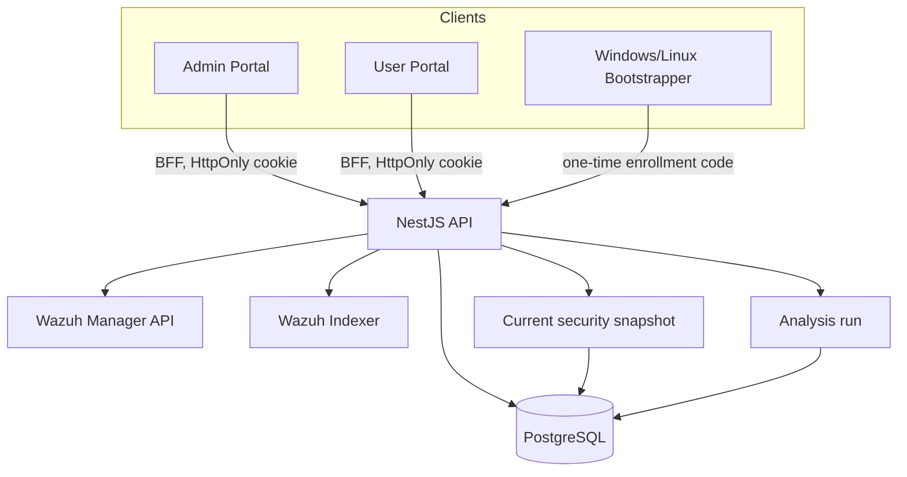
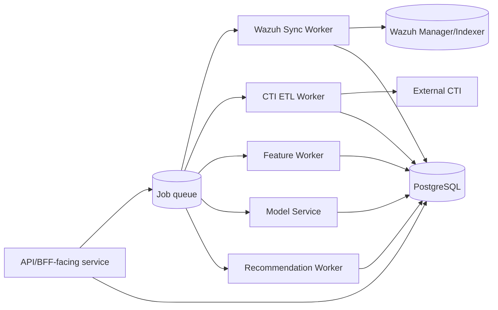

# Ghi chú kiến trúc sau review

## 1. As-is: hệ thống đang thực sự làm gì



### Dữ liệu hiện có

- identity: role, user, account status;
- device ownership;
- enrollment code và agent token hash;
- Wazuh Agent binding;
- analysis run;
- latest alert/inventory snapshot;
- heuristic score.

### Dữ liệu chưa có

- CTI normalized entities;
- vulnerability state theo endpoint/package;
- context snapshot lịch sử;
- ML feature/label/model;
- risk assessment/recommendation history.

## 2. Trust boundaries

1. **Browser ↔ Next.js BFF**: cookie HttpOnly, request mutation cần CSRF/origin hardening.
2. **BFF ↔ NestJS API**: internal HTTP; cần TLS/network policy ở production.
3. **Bootstrapper ↔ API**: public enrollment endpoint; cần rate limit, TLS và audit.
4. **API ↔ Wazuh Manager**: privileged lifecycle operation; service account riêng.
5. **API ↔ Wazuh Indexer**: read-only telemetry; account least-privilege.
6. **API/worker ↔ PostgreSQL**: dữ liệu người dùng, device, feature và prediction.
7. **External CTI ↔ ETL**: nguồn không hoàn toàn tin cậy; cần validation, provenance và snapshot.

## 3. To-be: chia service theo trách nhiệm



### Tách module đề xuất

- `WazuhManagerClient`: auth token, agent CRUD, syscollector.
- `WazuhIndexerClient`: search/index queries, pagination, PIT/search_after nếu cần.
- `VulnerabilitySyncService`: upsert theo source document ID/checkpoint.
- `EndpointContextSyncService`: append snapshot theo `as_of_time`.
- `CtiIngestionService`: NVD/EPSS/KEV/CSV, provenance và version.
- `FeatureBuilder`: deterministic, schema-versioned.
- `ModelInferenceService`: model version và input contract rõ ràng.
- `RiskAssessmentService`: append-only, không ghi đè lịch sử.
- `RecommendationService`: rule version + evidence.

## 4. Quy tắc dữ liệu

### Idempotency

- Mỗi nguồn có `source`, `source_document_id`, `source_updated_at`, `sync_run_id`.
- Unique constraint theo identity của document nguồn.
- Upsert chỉ khi `source_updated_at` hoặc content hash mới hơn.
- Job có checkpoint và có thể chạy lại an toàn.

### Time semantics

Tối thiểu phân biệt:

- `observed_at`: endpoint/source quan sát dữ liệu lúc nào;
- `ingested_at`: CYRP nhận lúc nào;
- `valid_from/valid_to`: trạng thái có hiệu lực khoảng nào;
- `as_of_time`: cutoff dùng để build feature;
- `predicted_at`: model chạy lúc nào.

### Provenance

Mỗi CTI/feature/prediction cần truy ngược được:

```text
source snapshot → normalized row → feature vector → model version → risk assessment
```

## 5. Migration theo từng bước

### A. Ổn định prototype

- hoàn thành rotate secret;
- full test/build;
- rate limit và audit;
- queue analysis run;
- current snapshot tiếp tục phục vụ UI.

### B. CTI foundation

- tạo CVE/CVSS/CWE/reference/product tables;
- import CSV hiện có;
- bổ sung NVD/EPSS/KEV;
- quality report và provenance.

### C. Endpoint vulnerability/context

- `detected_vulnerabilities`;
- `endpoint_context_snapshots` append-only;
- sync checkpoint và reconciliation;
- status ACTIVE/RESOLVED/MITIGATED.

### D. Dataset/model

- chốt target/label/time horizon;
- feature schema;
- time-aware split;
- baseline và model candidates;
- calibration/explainability.

### E. Product workflow

- risk assessment history;
- recommendation lifecycle;
- User/Admin detail screens;
- monitoring, retention và model governance.

## 6. Quyết định công nghệ đề xuất

- Giữ mô hình **responsive web, desktop-first**.
- Giữ PostgreSQL cho nghiệp vụ/CTI/ML metadata.
- Giữ Wazuh Indexer làm nguồn telemetry, không thêm Elasticsearch thứ hai.
- Dùng queue/worker trước khi scale API.
- Native mobile không phải ưu tiên của luận văn; PWA/notification có thể là phần mở rộng.
